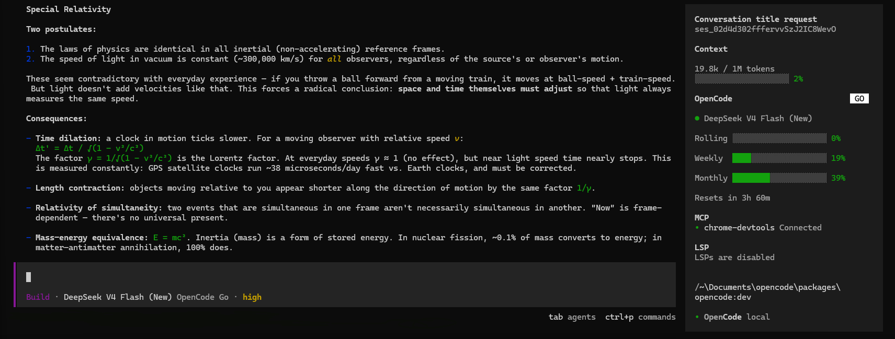

<p align="center">
  <a href="https://github.com/Rei-SU/opencode-prime">
    <picture>
      <source srcset="packages/console/app/src/asset/logo-ornate-dark.svg" media="(prefers-color-scheme: dark)">
      <source srcset="packages/console/app/src/asset/logo-ornate-light.svg" media="(prefers-color-scheme: light)">
      
    </picture>
  </a>
</p>
<p align="center">The open source AI coding agent, but with receipts.</p>
<p align="center">
  <a href="https://github.com/Rei-SU/opencode-prime"></a>
  <a href="https://github.com/Rei-SU/opencode-prime/releases"></a>
  <a href="https://opencode.ai/discord"></a>
</p>



---

OpenCode-Prime is [OpenCode](https://github.com/sst/opencode) — the open source
AI coding agent you already know — with a few quality-of-life upgrades bolted on
for people who actually live in their terminal.

It does everything OpenCode does: agents, tools, MCP, every provider under the
sun, plugins. Same engine, same TUI, same vibe. Then it adds the stuff that was
missing.

### What's different

- **Usage you can actually see.** A plan-aware sidebar that figures out whether
  you're on the Go, Zen, or Free plan and shows your **rolling, weekly, and
  monthly** usage with live data straight from your OpenCode account. No more
  refreshing the dashboard mid-session to check if you're about to hit a wall.
- **Context window, at a glance.** A clean progress bar showing your current
  tokens against the model's limit, plus how much the session has cost you
  (hidden when it's a flat \$0.00, because nobody needs that energy).
- **No more duplicated info.** Context and cost used to be crammed into the
  prompt bar and the subagent footer *and* the sidebar — the same three numbers
  in three places. Now it lives in one tidy spot.
- **Self-updating.** `opencode-prime self-update` swaps in the latest build
  safely on Linux, macOS, and Windows. No package managers, no `npm` globals,
  no chore.

### Install

```bash
curl -fsSL https://raw.githubusercontent.com/Rei-SU/opencode-prime/dev/install.sh | bash
```

On Windows, fire up PowerShell:

```powershell
irm https://raw.githubusercontent.com/Rei-SU/opencode-prime/dev/install.ps1 | iex
```

That's it. `opencode-prime` lands in `~/.opencode-prime/bin`, gets added to your
PATH, and you're off. When you want the freshest build, just:

```bash
opencode-prime self-update
```

Prefer to run from source? Clone the repo, `bun install`, then `bun dev`.

> [!NOTE]
> The usage panel reads your session from your local browser's cookie store —
> kept **in memory only**, never written to disk, only ever sent over HTTPS.
> Can't find it automatically? Wire it up once with
> `opencode-prime console import-cookie --cookie <auth> --workspace <id>`.

### Everything OpenCode already does

OpenCode-Prime inherits the whole OpenCode feature set, untouched:

- **Agents** — switch between `build` and `plan` with `Tab`; spin up `@general`
  subagents for gnarly searches
- **Models** — BYO key for OpenAI, Anthropic, Google, Groq, or run open models
  locally; OpenCode Go/Zen/Free built right in
- **Tools** — file editing, bash, ripgrep, web search, and the rest, behind a
  sane permission system
- **MCP** — plug in any Model Context Protocol server you like
- **Plugins** — extend the TUI, add commands, themes, keybindings, the works
- **Everywhere** — a terminal TUI, a `--server` mode for your editor, and
  integrations with VS Code and JetBrains

### Documentation

For the full rundown on config, agents, permissions, and the rest, [check the
docs](https://opencode.ai/docs).

### Contributing

Found a bug? Have an idea for the next quality-of-life upgrade? PRs are very
welcome — read the [contributing guide](./CONTRIBUTING.md) first.

### The fine print

OpenCode-Prime is an independent fork of OpenCode. It is not built by the
OpenCode team and isn't affiliated with them.

---

**Join the community** [Discord](https://discord.gg/opencode) · built on
[OpenCode](https://github.com/sst/opencode)
